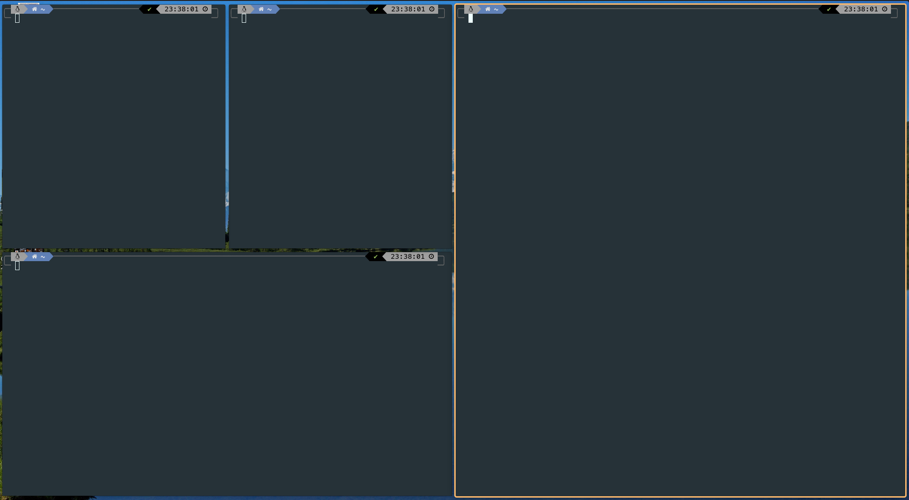
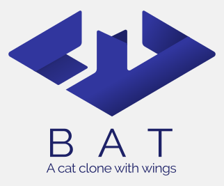

<h1 align="center">
  
  <br>
  My Dotfiles
  <br>
</h1>

[:es:](./README_ES.md) · [:gb:](./README.md)

## Content

- [Content](#content)

* [Fonts](#fonts)
* [Application launcher](#application-launcher)
   * [Rofi](#rocket-rofi)
* [Terminals](#desktop_computer-terminals)
   * [Zsh](#zsh)
* [Desktop configuration](#desktop-configuration)
   * [PopShell](#popshell)
   * [Tiling window manager resources](#tiling-window-manager-resources)
* [Code editors](#code-editors)
   * [NeoVim](#neovim)
      * [vim-plug](#vim-plug)
* [Productivity](#productivity)
* [Mail](#email-mail)
   * [MailSpring](#mailspring)
* [Command line tools](#keyboard-command-line-tools)
   * [LazyGit](#lazygit)
   * [Ranger](#star-ranger)
   * [BatCat](#bat-batcat)
   * [fzf](#mag_right-fzf)
   * [NMTUI](#signal_strength-nmtui)
   * [NCDU](#floppy_disk-ncdu)
   * [Trash-CLI](#recycle-trash-cli)
   * [exa](#notebook-exa)
   * [ctop](#ctop)
   * [z](#z)
* [Useful GitHub repos](#useful-github-repos)
* [Useful links](#useful-links)
   * [Dotfiles manager](#dotfiles-manager)

---------------------

This document shows the programs and configurations I have in the distributions I use. I currently work with:

- Pop! OS 20.04 - Gnome - Ubuntu based / Debian.
- Manjaro 20.2 - Gnome/Qtile - Arch.

File management and installation on the system has been done using [dotbot](https://github.com/anishathalye/dotbot).

## Fonts

- [Caskadya](https://github.com/ryanoasis/nerd-fonts/releases/download/v2.1.0/CascadiaCode.zip)
- [FiraCode](https://github.com/ryanoasis/nerd-fonts/releases/download/v2.1.0/FiraCode.zip)
- [Hurmit](https://github.com/ryanoasis/nerd-fonts/releases/download/v2.1.0/Hermit.zip)
- [BlexMono](https://github.com/ryanoasis/nerd-fonts/releases/download/v2.1.0/IBMPlexMono.zip)

*You can test all the fonts in [programmingfonts.org](https://www.programmingfonts.org/#cascadia-code).*

## Application launcher

### :rocket: Rofi

Rofi is a popular, easy and simple application launcher. Is a `dmenu` program. In a 'tiling window'  desktops environments is commonly executed by `Alt + D`.


Rofi installation:

- Debian:

  ```bash
  sudo apt install rofi
  ```

- Arch:

  ```bash
  sudo pacman -S rofi
  ```


Add the following command to your custom shortcuts in order to executed like the above animation (launcher + icons).

- Run programs:

  ```bash
  rofi -show drun -show-icons
  ```

- Show windows

  ```bash
  rofi -show window -show-icons
  ```

Copy the `photon-orange.rasi` theme to `/usr/share/rofi/themes` to complete the installation:

```bash
sudo cp ./config/rofi/photon-orange/photon-orange.rasi /usr/share/rofi/themes
```

And set the theme typing:

```bash
rofi-theme-selector
```


## :desktop_computer: Terminals

The terminals I normally use are:

- Alacritty
- Terminator
- rxvt-unicode

To change the default terminal type:

```bash
sudo update-alternatives --config x-terminal-emulator
```

A table will appear where the desired terminal is selected with a number.

### Zsh

My favorite shell is zsh. It's very easy to configure and you can add extensions that improve its capabilities. The extension for it to look like in the image is PowerLevel10k. This version includes a program to configure it quickly and easily :smile:.


Plugins:

- [zsh-syntax-highlighting](https://github.com/zsh-users/zsh-syntax-highlighting/blob/master/INSTALL.md)

- [zsh-autosuggestions](https://github.com/zsh-users/zsh-autosuggestions/blob/master/INSTALL.md)

  ```bash
  git clone https://github.com/zsh-users/zsh-autosuggestions.git ~/.zsh/zsh-autosuggestions
  source ~/.zsh/zsh-autosuggestions/zsh-autosuggestions.zsh
  ```

## Desktop configuration

### PopShell

[PopShell ](https://github.com/pop-os/shell) is a great and powerful tool for Linux distributions with Gnome as desktop environment that automatically manages the windows of the operating system by placing them in a logical way. At the same time, it adjusts keyboard shortcuts using the Vim shortcut map.



### Tiling window manager resources

- Qtile

- Multimonitor: [mons](https://github.com/Ventto/mons)

## Code editors

- VSCode
- Pycharm
- NVim

### NeoVim

**Neovim** is a fork – with additions – of Vim that strives to improve the extensibility and maintainability of Vim. Neovim has the same configuration syntax as Vim; thus the same configuration file can be used with both editors, although there are minor differences in details of options. If the added features of Neovim are not used, Neovim is compatible with almost all of Vim's features.


#### vim-plug

```bash
curl -fLo ~/.vim/autoload/plug.vim --create-dirs \
    https://raw.githubusercontent.com/junegunn/vim-plug/master/plug.vim
```

## Productivity

- [MarkText](https://github.com/marktext/marktext)
- [Focalboard](https://github.com/mattermost/focalboard)
- [Boostnote](https://boostnote.io/)
- [Dendron (a VSCode extension)](https://www.dendron.so/)

### :email: MailSpring

MailSpring is an Open Source and powerful mail client. I am using the "[predawn](https://github.com/adambmedia/N1-Predawn)" theme that the user "[asparc](https://github.com/asparc/predawn)" has modified.


To modify the theme you have to open the directory where it is installed.

- In **Ubuntu**: `~/snap/mailspring/common/packages/predawn`

- Enable the developer flags (Developer --> Run with debug flags)

- Reload the theme at each change by typing:

  ```react
  AppEnv.themes.setActiveTheme('ui-light'); // default theme (for example).
  AppEnv.themes.setActiveTheme('predawn');  // Custom theme.
  ```


## :keyboard: Command line tools

### LazyGit

[LazyGit](https://github.com/jesseduffield/lazygit) is a powerful command-line Git manager. The user interface is excellent and the ease of getting used to keyboard shortcuts increases your productivity. It brings a lot of value to your day-to-day work. You can see in the image an example of this same repository while I create it :wink:.


Installation:

- Debian

    ```bash
    sudo apt install lazygit
    ```
    
- Arch:

    ```bash
    sudo pacman -S lazygit
    ```

### :star: Ranger

[Ranger](https://github.com/ranger/ranger) is a powerful command-line file manager written in Python that allows you to move around very quickly using Vim's shortcuts.

Installing typing:

- Debian:

  ```bash
  sudo apt install ranger
  ```

- Arch:

  ```bash
  sudo pacman -S ranger
  ```

### :bat: BatCat

[BatCat](https://github.com/sharkdp/bat) is an extension for the *shell* that allows the contents of the formatted files to be viewed. It makes it easier to understand the code when we make a 'cat' on them. With the command `batcat <file>` we start it up. In the `.zshrc` file I have an alias to launch it with `cat`, keeping the original functionality of `cat` intact (to copy the content of a file the original `cat` is more useful since the lines of code don't appear).

In the following image you can see a simple example of a file in Python:


### :mag_right: fzf

[fzf](https://github.com/junegunn/fzf) is a very agile search engine for directories, files and commands on the interpreter's history, allowing searches using regular expressions and selecting the results from a list of best candidates. The use of the library is focused in its basic part on three commands:

| Atajo     | Resultado                            |
| --------- | ------------------------------------ |
| Control+T | Búsqueda de ficheros                 |
| Control+R | Búsqueda en el historial de comandos |
| Alt+C     | Búsqueda de directorios              |

Install:

- Debian:

  ```bash
  sudo apt install fzf
  ```

- Arch:

  ```bash
  sudo pacman -S fzf
  ```

Configuration:

```
git clone --depth 1 https://github.com/junegunn/fzf.git ~/.fzf
~/.fzf/install
```

### :signal_strength: NMTUI

In *tiling window manager* environments or environments focused on hyper-customization and keyboard use it is not common to have the *widget* to connect to a network via Wi-Fi. The NMTUI command line tool allows in an agile way to connect using a simple interface.

### :floppy_disk: NCDU

Command line disk analyzer in the style of the GUI version of Baobab.

Install:

- Debian:

  ```
  sudo apt install ncdu
  ```

### :recycle: Trash-CLI

[Trash-cli](https://github.com/andreafrancia/trash-cli) is a command line interface that helps prevent permanent file deletion that we would do with `rm`. With trash-cli we send files to the trash, list the contents, vary or restore files with a simple use of its commands:]

```bash
trash-put           envía archivos y carpetas a la papelera
trash-empty         eliminar el contenido de la papelera
trash-list          lista el contenido de la papelera
trash-restore       restaura un archivo de la papelera
trash-rm            elimina un único archivo de la papelera
```

Installation:

```bash
pip3 install -U trash-cli
```

### :notebook: exa

**exa** is a software to enhance the `ls` terminal command.


Based on `colorls` and `lsd` (LSDeluxe) and written in the Rust language, exa adds one more element of configuration: it allows you to configure the elements you want to display. Use is made of `alias` to launch different configurations.

Installation:

- Debian, by downloading the binary from the [releases](https://github.com/Peltoche/lsd/releases) section and using `dpkg`:

    ```bash
    sudo apt install exa
    ```

- Arch:

  ```bash
  sudo pacman -S exa
  ```


### ctop


[Ctop](https://github.com/bcicen/ctop) is a command line container manager that allows you to see the status of Docker containers as well as CPU and memory consumption with auto-refresh. Ideal for when you have several services at once and want to monitor performance. In the animation they have in their repository you can see an example:


### z

From *[habd.as](https://habd.as/post/installing-using-rupaz-shell-script/)*: [rupa/z](https://github.com/rupa/z) is an amazing shell script that allows users to traverse a filesystem in no time flat. Use it if you spend any time at all changing directories in a *nix environment. It will improve productivity and spare fat fingers quite a bit of backpedaling.

### :musical_note: ncstop

Lightweight Spotify client for command line.

[Link](https://github.com/hrkfdn/ncspot)

## Useful GitHub repos

- [github-markdown-toc](git@github.com:ekalinin/github-markdown-toc.git)

## Useful links

### Dotfiles manager

- [Dotbot blog](https://www.anishathalye.com/2014/08/03/managing-your-dotfiles/)

- [Dotfiles template](https://github.com/anishathalye/dotfiles_template)

- [Dotfiles sample using dotbot](https://github.com/anishathalye/dotfiles/blob/63131479f69634843989ac1e07e9ee94b9f21935/.install.conf.yaml#L24-L26)
- [More dotfiles sample](https://github.com/jesseleite/dotfiles/blob/master/install.conf.yaml)

- [Dotfiles repository with package installation](https://github.com/jsonMartin/dotfiles)

- [Dotfiles video tutorial](https://www.youtube.com/watch?v=E25gI87Ce1A)
- [Dotfiles blog](https://www.notion.so/ARCHIVED-How-to-easily-back-up-and-restore-your-Linux-configuration-software-using-GIT-and-dot-0cee0a7e2bbc49ec8a425f42525fdb3f)
