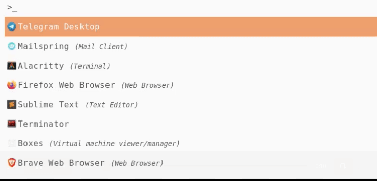
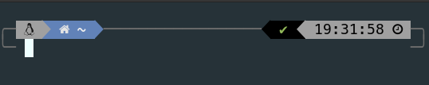
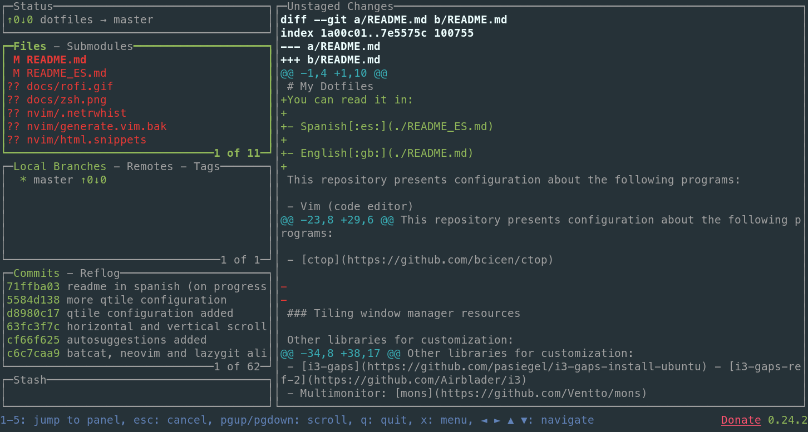

<h1 align="center">
  
  <br>
  My Dotfiles
  <br>
</h1>

[:es:](./README_ES.md) · [:gb:](./README.md)

## Content

- [Application launcher](#application-launcher)
  - [Rofi](#rofi)
- [Terminals](#terminals)
- [Zsh](#zsh)
- [Command-line tools](#commandline-tools)
  - [LazyGit](#lazygit)
  - [Ranger](#ranger)
  - [BatCat](#batcat)
  - [fzf](#fzf)
  - [NMTUI](#nmtui)
  - [NCDU](#ncdu)
  - [Trash-CLI](#trash-cli)
  - [LS Deluxe](#lsdeluxe)
  - [ctop](#ctop)

This repository presents configuration about the following programs:

- Neovim (code editor)
- Ranger (file manager)
- bspwm (window tiling manager)
- sxhkd (shortcuts for bspwm)

- [Polybar](https://github.com/polybar/polybar)

- Devhints: alias to return information about a library (hints) using [rich](https://github.com/willmcgugan/rich) Python library

- [zsh (ohmyzsh)](https://github.com/ohmyzsh/ohmyzsh)
- [powerlevel10k](https://github.com/romkatv/powerlevel10k)

### Tiling window manager resources

Other libraries for customization:

- [pywal](https://github.com/dylanaraps/pywal/wiki/Installation)
- bspwm
- [i3-gaps](https://github.com/pasiegel/i3-gaps-install-ubuntu) - [i3-gaps-ref-2](https://github.com/Airblader/i3)
- Multimonitor: [mons](https://github.com/Ventto/mons)

## Application launcher

### Rofi

Rofi is a popular, easy and simple application launcher. Is a `dmenu` program. In a 'tiling window'  desktops environments is commonly executed by `Alt + D`.



Rofi installation:

- Debian:

  ```bash
  sudo apt install rofi
  ```

- Arch:

  ```bash
  sudo pacman -S rofi
  ```


Add the following command to your custom shortcuts in order to executed like the above animation (launcher + icons).

- Run programs:

  ```bash
  rofi -show drun -show-icons
  ```

- Show windows

  ```bash
  rofi -show window -show-icons
  ```

Copy the `photon-orange.rasi` theme to `/usr/share/rofi/themes` to complete the installation:

```bash
sudo cp ./config/rofi/photon-orange.rasi /usr/share/rofi/themes
```

## Terminals

The terminals I normally use are:

- Alacritty
- Terminator

### Zsh

My favorite shell is zsh. It's very easy to configure and you can add extensions that improve its capabilities. The extension for it to look like in the image is PowerLevel10k. This version includes a program to configure it quickly and easily :smile:.



Plugins:

- [zsh-syntax-highlighting](https://github.com/zsh-users/zsh-syntax-highlighting/blob/master/INSTALL.md)

- [zsh-autosuggestions](https://github.com/zsh-users/zsh-autosuggestions/blob/master/INSTALL.md)

  ```bash
  git clone https://github.com/zsh-users/zsh-autosuggestions.git ~/.zsh/zsh-autosuggestions
  source ~/.zsh/zsh-autosuggestions/zsh-autosuggestions.zsh
  ```


## Command line tools

## LazyGit

[LazyGit](https://github.com/jesseduffield/lazygit) is a powerful command-line Git manager. The user interface is excellent and the ease of getting used to keyboard shortcuts increases your productivity. It brings a lot of value to your day-to-day work. You can see in the image an example of this same repository while I create it :wink:.



Installation:

- Debian

    ```bash
    sudo apt install lazygit
    ```
    
- Arch:

    ```bash
    sudo pacman -S lazygit
    ```

## Ranger

[Ranger](https://github.com/ranger/ranger) is a powerful command-line file manager written in Python that allows you to move around very quickly using Vim's shortcuts.

Installing typing:

- Debian:

  ```bash
  sudo apt install ranger
  ```

- Arch:

  ```bash
  sudo pacman -S ranger
  ```

## BatCat

[BatCat](https://github.com/sharkdp/bat) is an extension for the *shell* that allows the contents of the formatted files to be viewed. It makes it easier to understand the code when we make a 'cat' on them. With the command `batcat <file>` we start it up. In the `.zshrc` file I have an alias to launch it with `cat`, keeping the original functionality of `cat` intact (to copy the content of a file the original `cat` is more useful since the lines of code don't appear).

In the following image you can see a simple example of a file in Python:


## :mag_right: fzf

[fzf](https://github.com/junegunn/fzf) is a very agile search engine for directories, files and commands on the interpreter's history, allowing searches using regular expressions and selecting the results from a list of best candidates. The use of the library is focused in its basic part on three commands:

| Atajo     | Resultado                            |
| --------- | ------------------------------------ |
| Control+T | Búsqueda de ficheros                 |
| Control+R | Búsqueda en el historial de comandos |
| Alt+C     | Búsqueda de directorios              |

Install:

- Debian:

  ```bash
  sudo apt install fzf
  ```

- Arch:

  ```bash
  sudo pacman -S fzf
  ```

## :signal_strength: NMTUI

In *tiling window manager* environments or environments focused on hyper-customization and keyboard use it is not common to have the *widget* to connect to a network via Wi-Fi. The NMTUI command line tool allows in an agile way to connect using a simple interface.

## :floppy_disk: NCDU

Command line disk analyzer in the style of the GUI version of Baobab.

Install:

- Debian:

  ```
  sudo apt install ncdu
  ```

## :recycle: ​Trash-CLI

[Trash-cli](https://github.com/andreafrancia/trash-cli) is a command line interface that helps prevent permanent file deletion that we would do with `rm`. With trash-cli we send files to the trash, list the contents, vary or restore files with a simple use of its commands:]

```bash
trash-put           envía archivos y carpetas a la papelera
trash-empty         eliminar el contenido de la papelera
trash-list          lista el contenido de la papelera
trash-restore       restaura un archivo de la papelera
trash-rm            elimina un único archivo de la papelera
```

Installation:

```bash
pip3 install -U trash-cli
```

## LSD (LSDeluxe)

LSD is a software to enhance the `ls` terminal command.


Based on `colorls` and written in the Rust language, `lsd` adds one more configuration element: it allows you to configure the elements you want to display by making use of a `config.yaml` configuration file located in the user's personal folder: `~/.config/lsd/config.yaml`. This directory is automatically created when the program is installed.

Installation:

- Debian, by downloading the binary from the [releases](https://github.com/Peltoche/lsd/releases) section and using `dpkg`:

    ```bash
    sudo dpkg -i lsd_0.19.0_amd64.deb # adapt version number and architecture
    ```

- Arch:

  ```bash
  sudo pacman -S lsd
  ```


## ctop

## 

[Ctop](https://github.com/bcicen/ctop) is a command line container manager that allows you to see the status of Docker containers as well as CPU and memory consumption with auto-refresh. Ideal for when you have several services at once and want to monitor performance. In the animation they have in their repository you can see an example:

