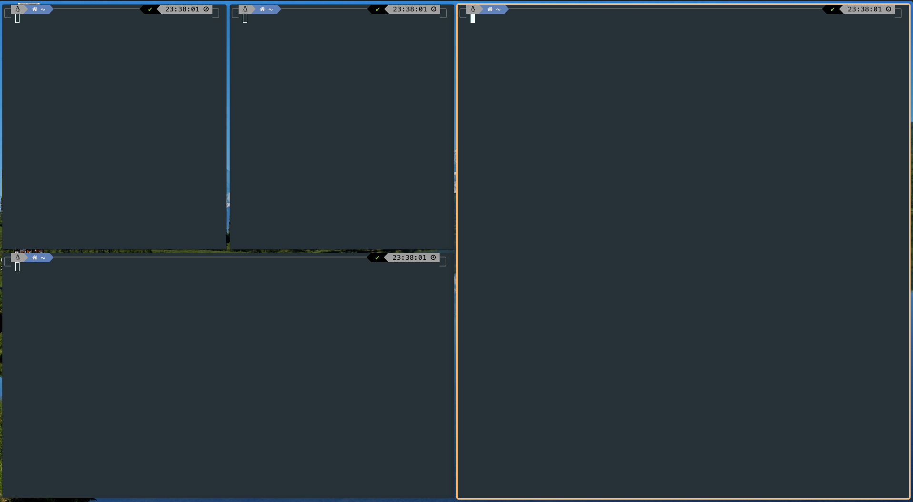
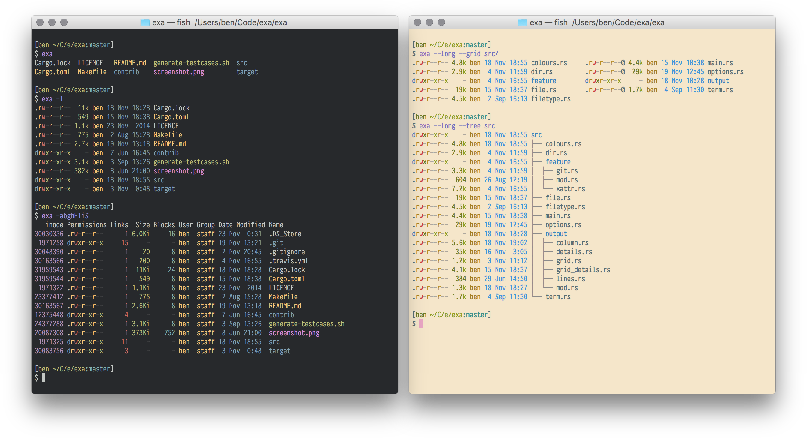

<h1 align="center">
  
  <br>
  Mis archivos de configuración
  <br>
</h1>
[:gb:](./README.md) · [:es:](./README_ES.md) 

## Contenido

* [Contenido](#contenido)
* [Fonts](#fonts)
* [Lanzador de aplicaciones](#lanzador-de-aplicaciones)
   * [Rofi](#rocket-rofi)
* [Terminales](#desktop_computer-terminales)
   * [Zsh](#zsh)
* [Entorno de escritorio](#entorno-de-escritorio)
   * [PopShell](#popshell)
   * [Recursos para entornos de ventana en mosaico](#recursos-para-entornos-de-ventana-en-mosaico)
* [Editores de código](#editores-de-código)
* [NeoVim](#neovim)
   * [vim-plug](#vim-plug)
* [Productivity](#productivity)
* [Mail](#email-mail)
   * [MailSpring](#mailspring)
* [Herramientas por línea de comandos](#keyboard-herramientas-por-línea-de-comandos)
   * [LazyGit](#lazygit)
* [Ranger](#star-ranger)
* [BatCat](#bat-batcat)
* [fzf](#mag_right-fzf)
* [NMTUI](#signal_strength-nmtui)
* [NCDU](#floppy_disk-ncdu)
* [Trash-CLI](#recycle-trash-cli)
* [exa](#notebook-exa)
* [ctop](#ctop)
* [z](#z)
* [Useful GitHub repos](#useful-github-repos)
* [Enlaces de utilidad](#enlaces-de-utilidad)
* [Gestor de ficheros de configuración](#gestor-de-ficheros-de-configuración)

------

En este documento se muestran los programas y configuraciones que tengo en las distribuciones que uso. Actualmente trabajo con:

- Pop! OS 20.04 - Gnome - Ubuntu based / Debian.
- Manjaro 20.2 - Kde/Qtile - Arch.

La gestión de los archivos y la instalación en el sistema se ha realizado usando [dotbot](https://github.com/anishathalye/dotbot).

## Fonts

- [Caskadya](https://github.com/ryanoasis/nerd-fonts/releases/download/v2.1.0/CascadiaCode.zip)
- [FiraCode](https://github.com/ryanoasis/nerd-fonts/releases/download/v2.1.0/FiraCode.zip)
- [Hurmit](https://github.com/ryanoasis/nerd-fonts/releases/download/v2.1.0/Hermit.zip)
- [BlexMono](https://github.com/ryanoasis/nerd-fonts/releases/download/v2.1.0/IBMPlexMono.zip)

*Pueden probarse las fuentes de manera online en [programmingfonts.org](https://www.programmingfonts.org/#cascadia-code).*

## Lanzador de aplicaciones

### :rocket: Rofi

Rofi es un lanzador de aplicaciones muy popular, simple y sencillo de configurar. Es un programa de los denominados `dmenu`. En entornos de escritorio de tipo *'tiling window'* se ejecuta este programa con el atajo: `Alt + D`.


Instalar Rofi:

- Debian:

    ```bash
    sudo apt install rofi
    ```
    
- Arch:

    ```bash
    sudo pacman -S rofi
    ```

Con los siguientes comandos en un terminal puedes ejecutar Rofi. Agrega el comando como un atajo de teclado para ejecutarlo más rápido:

- Lanzar los programas:

  ```bash
  rofi -show drun -show-icons
  ```

- Mover a la ventana: 

  ```bash
  rofi -show window -show-icons
  ```

Para instalar el tema que ves en la animación anterior copia el fichero con el tema  `photon-orange.rasi` en `/usr/share/rofi/themes`:

```
sudo cp ./config/rofi/photon-orange.rasi /usr/share/rofi/themes
```

## :desktop_computer: Terminales

Los terminales que uso son:

- Alacritty
- Terminator

Para cambiar el terminal por defecto escribir:

```bash
sudo update-alternatives --config x-terminal-emulator
```

Aparecerá una tabla donde se selecciona con un número el terminal deseado.

### Zsh

La shell que utilizo es Zsh por su facilidad en la configuración y en la inclusión de extensiones que mejoran sus capacidades. La extensión para que se vea como en la imagen es PowerLevel10k. Esta versión incluye un programa para configurarlo de manera rápida y fácil :smile:.


Extensiones:

- [zsh-syntax-highlighting](https://github.com/zsh-users/zsh-syntax-highlighting/blob/master/INSTALL.md)

- [zsh-autosuggestions](https://github.com/zsh-users/zsh-autosuggestions/blob/master/INSTALL.md)

  ```bash
  git clone https://github.com/zsh-users/zsh-autosuggestions.git ~/.zsh/zsh-autosuggestions
  source ~/.zsh/zsh-autosuggestions/zsh-autosuggestions.zsh
  ```

## Entorno de escritorio

### PopShell

[PopShell ](https://github.com/pop-os/shell) es una gran y potente herramienta para distribuciones Linux con Gnome como entorno de escritorio que gestiona automáticamente las ventanas del sistema operativo colocándolas de forma lógica. Al mismo tiempo, ajusta los atajos de teclado utilizando el mapa de atajos de Vim.



### Recursos para entornos de ventana en mosaico

- Qtile
- Multimonitor: [mons](https://github.com/Ventto/mons)

## Editores de código

- VSCode
- Pycharm
- NVim

## NeoVim

Neovim is a fork – with additions – of Vim that strives to improve the extensibility and maintainability of Vim. Neovim has the same configuration syntax as Vim; thus the same configuration file can be used with both editors, although there are minor differences in details of options. If the added features of Neovim are not used, Neovim is compatible with almost all of Vim's features.

### vim-plug

```bash
curl -fLo ~/.vim/autoload/plug.vim --create-dirs \
    https://raw.githubusercontent.com/junegunn/vim-plug/master/plug.vim
```

## Productivity

- [MarkText](https://github.com/marktext/marktext)
- [Focalboard](https://github.com/mattermost/focalboard)

## :email: Mail

### MailSpring

MailsSpring es un poderoso cliente de correo de código libre. Uso el cliente con el tema "[predawn](https://github.com/adambmedia/N1-Predawn)", modificado por el usuario   "[asparc](https://github.com/asparc/predawn)".


Para modificar un tema, hay que abrir el directorio donde se instala el programa:

- En **Ubuntu**: `~/snap/mailspring/common/packages/predawn`
- Habilitar el modo desarrollador (opción Developer -> Lanzar el programa con las opciones de depuración).
- Recargar el tema con cada cambio, escribiendo:

    ```react
    AppEnv.themes.setActiveTheme('ui-light'); // default theme (for example).
    AppEnv.themes.setActiveTheme('predawn');  // Custom theme.
    ```


## :keyboard: Herramientas por línea de comandos

### LazyGit

[LazyGit](https://github.com/jesseduffield/lazygit) es un potente gestor de Git por línea de comandos. Su apartado visual y la facilidad para acostumbrarte a los atajos de teclado hace que manejarlo aumente la productividad. Aporta mucho valor en el trabajo del día a día. Puedes ver en la imagen un ejemplo de este mismo repositorio mientras lo creo :wink:.


Para instalarlo:

- Debian

    ```bash
    sudo apt install lazygit
    ```
    
- Arch:

    ```bash
    sudo pacman -S lazygit
    ```


## :star: Ranger

[Ranger](https://github.com/ranger/ranger) es un potente gestor de ficheros por línea de comandos escrito en Python que permite moverte de manera muy ágil usando los atajos de Vim.

Para instalarlo:

- Debian:

  ```bash
  sudo apt install ranger
  ```

- Arch:

  ```bash
  sudo pacman -S ranger
  ```

## :bat: BatCat

[BatCat](https://github.com/sharkdp/bat) es una extensión para la *shell* que permite ver el contenido de los ficheros con formato. Facilita entender el código  cuando hacemos un `cat` sobre ellos. Con el comando `batcat <fichero>` lo ponemos en marcha. En el fichero`.zshrc` tengo un alias para lanzarlo con `ccat`, manteniendo la funcionalidad original de `cat` intacta (para copiar el contenido de un fichero es más útil el `cat` original ya que no aparecen las líneas de código).

En la siguiente imagen puedes ver un ejemplo simple de un fichero en Python:


## :mag_right: fzf

[fzf](https://github.com/junegunn/fzf) es un buscador de directorios, ficheros y comandos sobre el historial del intérprete muy ágil y que permite búsquedas usando expresiones regulares y seleccionar los resultados de una lista de mejores candidatos. El uso de la librería se centra en su parte básica en tres comandos:

| Atajo     | Resultado                            |
| --------- | ------------------------------------ |
| Control+T | Búsqueda de ficheros                 |
| Control+R | Búsqueda en el historial de comandos |
| Alt+C     | Búsqueda de directorios              |

Instalación:

- Debian:

  ```bash
  sudo apt install fzf
  ```

- Arch:

  ```bash
  sudo pacman -S fzf
  ```

## :signal_strength: NMTUI

En entornos de tipo *tiling window manager* o enfocados a la hiper-personalización y el uso del teclado no suele ser común tener el *widget* para conectarse a una red vía Wi-Fi. La herramienta por línea de comandos NMTUI permite de una manera ágil conectarse usando una interfaz simple.

## :floppy_disk: NCDU

Analizador de disco por línea de comandos al estilo de la versión GUI de Baobab.

Instalación:

- Debian

  ```
  sudo apt install ncdu
  ```

## :recycle: Trash-CLI

[Trash-cli](https://github.com/andreafrancia/trash-cli) es un interfaz por línea de comandos que ayuda prevenir borrado de archivos definitivo que haríamos con `rm`. Con trash-cli enviamos ficheros a la papelera, listamos el contenido, variamos o restauramos ficheros con un simple uso de sus comandos:

```bash
trash-put           envía archivos y carpetas a la papelera
trash-empty         eliminar el contenido de la papelera
trash-list          lista el contenido de la papelera
trash-restore       restaura un archivo de la papelera
trash-rm            elimina un único archivo de la papelera
```

Para instalar:

```bash
pip3 install -U trash-cli
```

## :notebook: exa

**exa** es un software para vitaminar el comando por terminal `ls`.



Basándose en `colorls` y en `lsd` (LSDeluxe) y escrito en el lenguaje Rust, exa añade un elemento más de configuración: permite configurar los elementos que se quieren mostrar. Se hacen uso de los `alias` para lanzar diferentes configuraciones.

Instalación:

- Debian, descargando el binario de la [sección de "releases"](https://github.com/Peltoche/lsd/releases) y haciendo uso de `dpkg`:

  ```bash
  sudo apt install exa
  ```

- Arch:

  ```bash
  sudo pacman -S exa
  ```

## ctop

[Ctop](https://github.com/bcicen/ctop) es un gestor de contenedores por línea de comandos que permite ver el estado de los contenedores Docker así como el consumo de CPU y memoria con autorefresco. Ideal para cuando se tienen varios servicios a la vez y se quiere vigilar el rendimiento. En la animación que tienen en su repositorio puede verse un ejemplo:


## z

From *[habd.as](https://habd.as/post/installing-using-rupaz-shell-script/)*: [rupa/z](https://github.com/rupa/z) is an amazing shell script that allows users to traverse a filesystem in no time flat. Use it if you spend any time at all changing directories in a *nix environment. It will improve productivity and spare fat fingers quite a bit of backpedaling.

## Useful GitHub repos

- [github-markdown-toc](git@github.com:ekalinin/github-markdown-toc.git)

## Enlaces de utilidad

## Gestor de ficheros de configuración

- [Blog de Dotbot](https://www.anishathalye.com/2014/08/03/managing-your-dotfiles/)

- [Plantilla de ficheros de configuración](https://github.com/anishathalye/dotfiles_template)

- [Ejemplo de uso de Dotfiles](https://github.com/anishathalye/dotfiles/blob/63131479f69634843989ac1e07e9ee94b9f21935/.install.conf.yaml#L24-L26)
- [Más ejemplos de configuracíon](https://github.com/jesseleite/dotfiles/blob/master/install.conf.yaml)

- [Repositorio con scripts para instalar paquetes en el sistema](https://github.com/jsonMartin/dotfiles)

- [Dotfiles tutorial en videov](https://www.youtube.com/watch?v=E25gI87Ce1A)
- [Otro blog de Dotfiles](https://www.notion.so/ARCHIVED-How-to-easily-back-up-and-restore-your-Linux-configuration-software-using-GIT-and-dot-0cee0a7e2bbc49ec8a425f42525fdb3f)