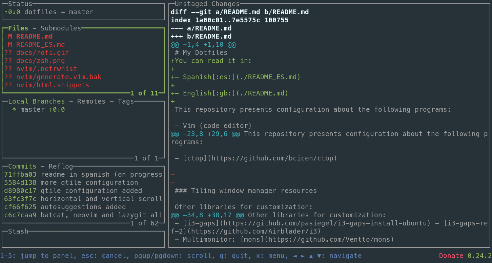
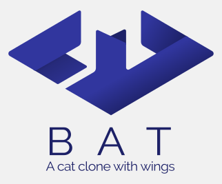
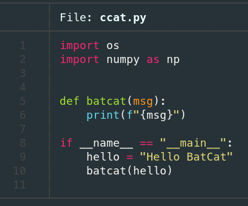

<h1 align="center">
  
  <br>
  Mis archivos de configuración
  <br>
</h1>

[:es:](./README_ES.md) · [:gb:](./README.md)

## Contenido

- [Lanzador de aplicaciones](#lanzador-de-aplicaciones)
  - [Rofi](#rofi)
- [Terminales](#terminales)
- [Zsh](#zsh)
- [Herramientas por línea de comandos](#herramientas-por-linea-de-comandos)
  - [LazyGit](#lazygit)
  - [Ranger](#ranger)
  - [BatCat](#batcat)
  - [fzf](#fzf)
  - [NMTUI](#nmtui)
  - [NCDU](#ncdu)
  - [Trash-CLI](#trash-cli)
  - [LS Deluxe](#lsdeluxe)
  - [ctop](#ctop)

------

En este documento se muestran los programas y configuraciones que tengo en las distribuciones que uso. Actualmente trabajo con:

- Pop! OS 20.04 - Gnome - Ubuntu based / Debian.
- Manjaro 20.2 - Kde/Qtile - Arch.

Los programas que suelo usar son:

- Neovim (code editor)
- Ranger (file manager)
- bspwm (window tiling manager)
- sxhkd (shortcuts para bspwn)

- Devhints: alias to return information about a library (hints) using [rich](https://github.com/willmcgugan/rich) Python library

- [zsh (ohmyzsh)](https://github.com/ohmyzsh/ohmyzsh)
- [powerlevel10k](https://github.com/romkatv/powerlevel10k)
- [ctop](https://github.com/bcicen/ctop)

## Lanzador de aplicaciones

### :rocket: Rofi

Rofi es un lanzador de aplicaciones muy popular, simple y sencillo de configurar. Es un programa de los denominados `dmenu`. En entornos de escritorio de tipo *'tiling window'* se ejecuta este programa con el atajo: `Alt + D`.


Instalar Rofi:

- Debian:

    ```bash
    sudo apt install rofi
    ```
    
- Arch:

    ```bash
    sudo pacman -S rofi
    ```

Con los siguientes comandos en un terminal puedes ejecutar Rofi. Agrega el comando como un atajo de teclado para ejecutarlo más rápido:

- Lanzar los programas:

  ```bash
  rofi -show drun -show-icons
  ```

- Mover a la ventana: 

  ```bash
  rofi -show window -show-icons
  ```

Para instalar el tema que ves en la animación anterior copia el fichero con el tema  `photon-orange.rasi` en `/usr/share/rofi/themes`:

```
sudo cp ./config/rofi/photon-orange.rasi /usr/share/rofi/themes
```

## :desktop_computer: Terminales

Los terminales que uso son:

- Alacritty
- Terminator

### Zsh

La shell que utilizo es Zsh por su facilidad en la configuración y en la inclusión de extensiones que mejoran sus capacidades. La extensión para que se vea como en la imagen es PowerLevel10k. Esta versión incluye un programa para configurarlo de manera rápida y fácil :smile:.


Extensiones:

- [zsh-syntax-highlighting](https://github.com/zsh-users/zsh-syntax-highlighting/blob/master/INSTALL.md)

- [zsh-autosuggestions](https://github.com/zsh-users/zsh-autosuggestions/blob/master/INSTALL.md)

  ```bash
  git clone https://github.com/zsh-users/zsh-autosuggestions.git ~/.zsh/zsh-autosuggestions
  source ~/.zsh/zsh-autosuggestions/zsh-autosuggestions.zsh
  ```

## Herramientas por línea de comandos

### :tree LazyGit

[LazyGit](https://github.com/jesseduffield/lazygit) es un potente gestor de Git por línea de comandos. Su apartado visual y la facilidad para acostumbrarte a los atajos de teclado hace que manejarlo aumente la productividad. Aporta mucho valor en el trabajo del día a día. Puedes ver en la imagen un ejemplo de este mismo repositorio mientras lo creo :wink:.



Para instalarlo:

- Debian

    ```bash
    sudo apt install lazygit
    ```
    
- Arch:

    ```bash
    sudo pacman -S lazygit
    ```


## :star: Ranger

[Ranger](https://github.com/ranger/ranger) es un potente gestor de ficheros por línea de comandos escrito en Python que permite moverte de manera muy ágil usando los atajos de Vim.

Para instalarlo:

- Debian:

  ```bash
  sudo apt install ranger
  ```

- Arch:

  ```bash
  sudo pacman -S ranger
  ```

## :bat: BatCat

[BatCat](https://github.com/sharkdp/bat) es una extensión para la *shell* que permite ver el contenido de los ficheros con formato. Facilita entender el código  cuando hacemos un `cat` sobre ellos. Con el comando `batcat <fichero>` lo ponemos en marcha. En el fichero`.zshrc` tengo un alias para lanzarlo con `ccat`, manteniendo la funcionalidad original de `cat` intacta (para copiar el contenido de un fichero es más útil el `cat` original ya que no aparecen las líneas de código).

En la siguiente imagen puedes ver un ejemplo simple de un fichero en Python:



## :mag_right: fzf

[fzf](https://github.com/junegunn/fzf) es un buscador de directorios, ficheros y comandos sobre el historial del intérprete muy ágil y que permite búsquedas usando expresiones regulares y seleccionar los resultados de una lista de mejores candidatos. El uso de la librería se centra en su parte básica en tres comandos:

| Atajo     | Resultado                            |
| --------- | ------------------------------------ |
| Control+T | Búsqueda de ficheros                 |
| Control+R | Búsqueda en el historial de comandos |
| Alt+C     | Búsqueda de directorios              |

Instalación:

- Debian:

  ```bash
  sudo apt install fzf
  ```

- Arch:

  ```bash
  sudo pacman -S fzf
  ```

## :signal_strength: NMTUI

En entornos de tipo *tiling window manager* o enfocados a la hiper-personalización y el uso del teclado no suele ser común tener el *widget* para conectarse a una red vía Wi-Fi. La herramienta por línea de comandos NMTUI permite de una manera ágil conectarse usando una interfaz simple.

## :floppy_disk: NCDU

Analizador de disco por línea de comandos al estilo de la versión GUI de Baobab.

Instalación:

- Debian

  ```
  sudo apt install ncdu
  ```

## :recycle: Trash-CLI

[Trash-cli](https://github.com/andreafrancia/trash-cli) es un interfaz por línea de comandos que ayuda prevenir borrado de archivos definitivo que haríamos con `rm`. Con trash-cli enviamos ficheros a la papelera, listamos el contenido, variamos o restauramos ficheros con un simple uso de sus comandos:

```bash
trash-put           envía archivos y carpetas a la papelera
trash-empty         eliminar el contenido de la papelera
trash-list          lista el contenido de la papelera
trash-restore       restaura un archivo de la papelera
trash-rm            elimina un único archivo de la papelera
```

Para instalar:

```bash
pip3 install -U trash-cli
```

## LSD (LSDeluxe)

LSD es un software para vitaminar el comando por terminal `ls`.


Basándose en `colorls` y escrito en el lenguaje Rust, `lsd` añade un elemento más de configuración: permite configurar los elementos que se quieren mostrar haciendo uso de un fichero de configuración `config.yaml` alojado en la carpeta personal del usuario: `~/.config/lsd/config.yaml`. Este directorio se crea automáticamente cuando se instala el programa.

Instalación:

- Debian, descargando el binario de la [sección de "releases"](https://github.com/Peltoche/lsd/releases) y haciendo uso de `dpkg`:

  ```bash
  sudo dpkg -i lsd_0.19.0_amd64.deb # adapt version number and architecture
  ```

- Arch:

  ```bash
  sudo pacman -S lsd
  ```

## ctop

[Ctop](https://github.com/bcicen/ctop) es un gestor de contenedores por línea de comandos que permite ver el estado de los contenedores Docker así como el consumo de CPU y memoria con autorefresco. Ideal para cuando se tienen varios servicios a la vez y se quiere vigilar el rendimiento. En la animación que tienen en su repositorio puede verse un ejemplo:

